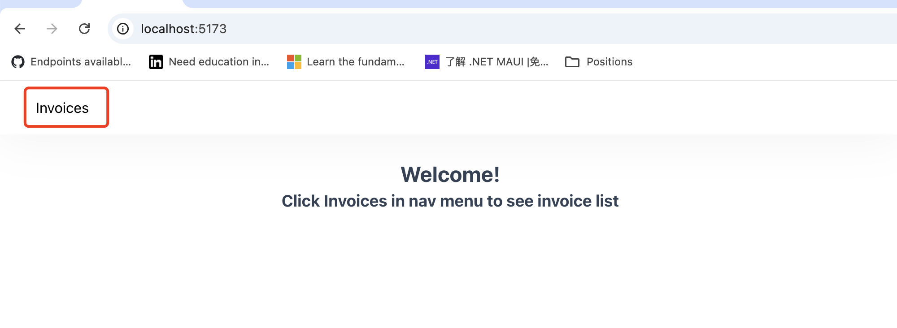

# ASSIGNMENT: Invoice list and detail page

## Setup

1. Run `npm install` and `npm run dev` to start the vite server.
2. Access `http://localhost:5173` in your browser.

## Usage

### Invoice List
Click the invoice on the top nav menu and you will be navigated to invoices list page.

In the list, you can check the invoice list and their status. Every row has a detail button on the right.
You can go to detail page by hitting the button.

### Invoice Detail
Check the detail of invoice in this page and you can see the chase email preview by clicking the chase button.

